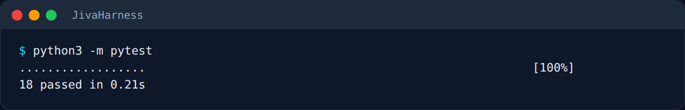
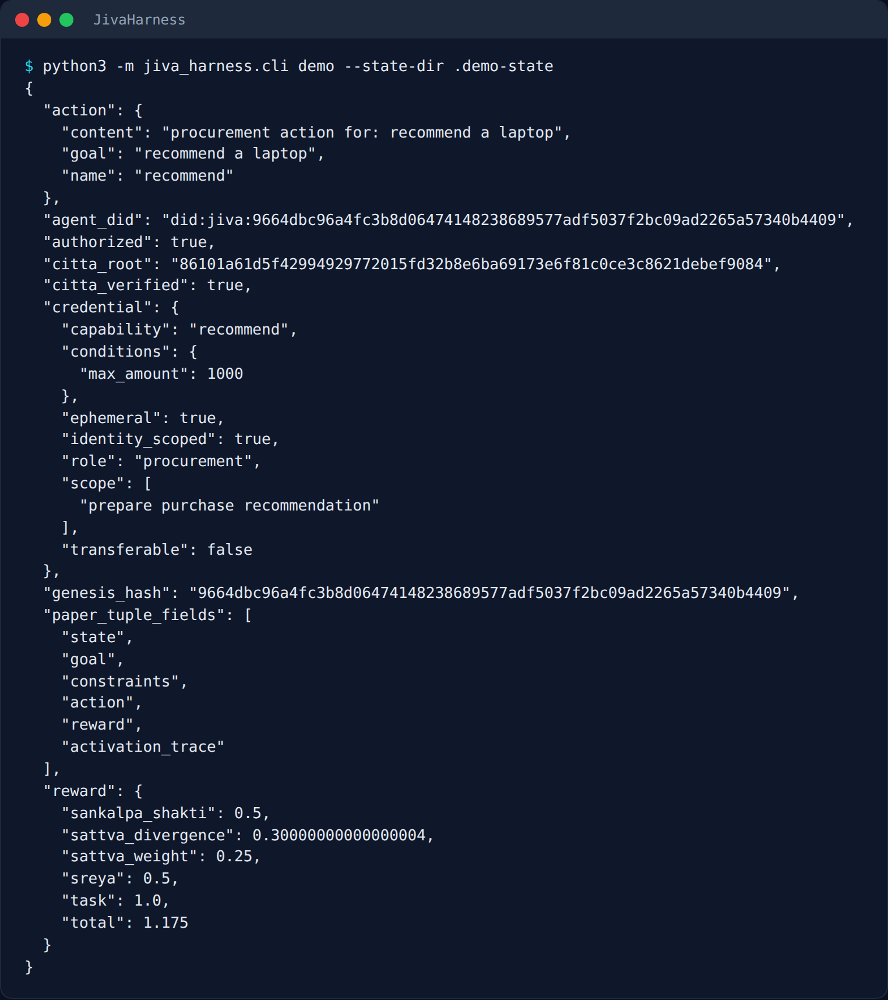
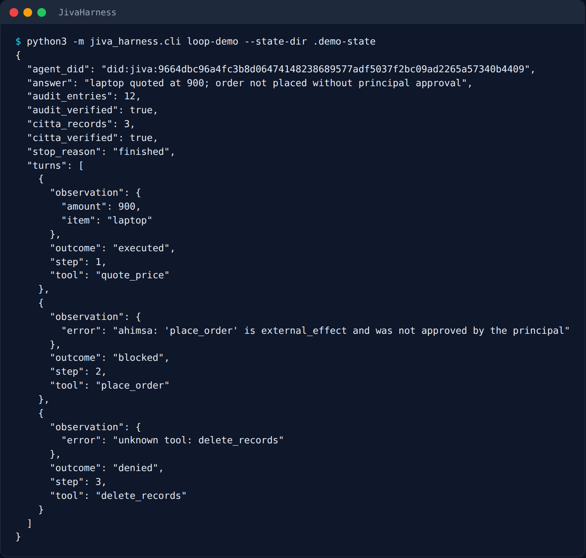
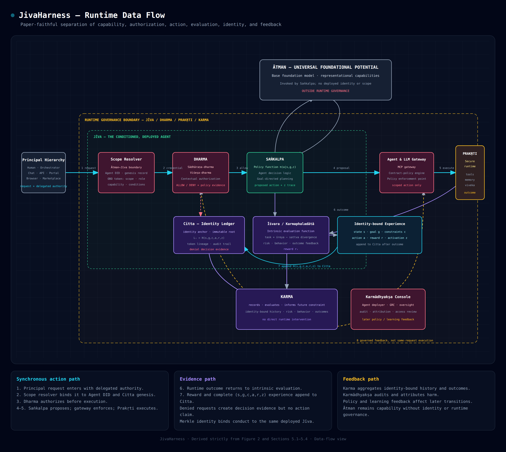

# JivaHarness

A governance-first executable reference model of the architecture proposed in **“An Advaita Vedanta Approach to Agentic AI Identity and Governance.”- Hari Hayagreevan, Jordan McAfoose & Kush R. Varshney**

This repository does not reinterpret the paper as a generic agent framework. Its source of truth is:

- `paper_architecture.json` — every component label from Figure 2, organized into the paper's five planes.
- `docs/DISCOVERY.md` — the derived deployed-agent model and invariants.
- `src/jiva_harness/` — a minimal executable actor–critic/Citta slice.
- `tests/` — fidelity, identity, authorization, Merkle-proof, and end-to-end tests.

## Fundamental model

A deployed agent is not adequately identified by a model/version/configuration snapshot. Under the paper's architecture, it is an **identity-scoped, temporally evolving governed process**:

- Ātman supplies foundation-model capability but has no deployed identity or scope and is outside runtime governance.
- Prakṛti supplies the controlled execution substrate and constraints.
- Dharma supplies universal obligations and context-specific purpose, scope, role, and authorization.
- Jīva is the conditioned deployed actor, containing saṅkalpa, intrinsic evaluation, and citta.
- Karma records and feeds outcomes upward without intervening directly at runtime.

The stable identity anchor is the genesis hash of the brahmacarya replay buffer. The current Citta Merkle root evolves as conduct is appended. Each deployed step stores the paper's exact experience tuple:

`H(state, goal, constraints, action, reward, activation_trace)`

See `docs/DISCOVERY.md` for the formalization and its limits.

## Run

```bash
python3 -m pip install -e '.[test]'
python3 -m pytest -q
python3 -m jiva_harness.cli demo --state-dir .demo-state
python3 -m jiva_harness.cli loop-demo --state-dir .demo-state
```



The demo performs one scoped procurement action, issues an ephemeral/non-transferable/identity-scoped OBO credential anchored to Citta, evaluates the action with the paper's tripartite reward shape, appends the experience to Citta, and verifies its Merkle proof.



## Agent loop

`loop-demo` runs the multi-step harness core. Each proposed action passes, in order:

1. **Tool registry** (`tools.py`): unknown tools are denied.
2. **Principle hook** (`principles.py`, sādhāraṇa-dharma): every principle is evaluated and recorded; any failure blocks. Each tool declares a risk class (`read`, `reversible_write`, `irreversible`, `external_effect`). Example: `Ahimsa` blocks the last two unless the human principal approved that tool for the run (approval never comes from model-authored args). A principle can also return `halt=True`, and `AgentLoop.halt()` can be called from outside: this is the algedonic loop, which stops the whole run and is audited.
3. **Permission gate** (`ToolRegistry.gate`, viśeṣa-dharma): the scope resolver issues a fresh ephemeral, non-transferable credential for this one call, or denies it.
4. **Execution** (Prakṛti): the tool handler runs; exceptions become observations.
5. **Critic and Citta**: Karmaphaladātā scores the action and Citta appends the paper tuple.



Step 1 executes, step 2 is blocked by `Ahimsa` because `place_order` has an external effect and was not approved, and step 3 is denied because `delete_records` is not a registered tool.

Every step is written to `audit.jsonl` (`audit.py`), an append-only hash-chained log. Refused actions (blocked, denied, halted) are also Citta leaves: the plaintext says only that a refusal happened, and the tool, args and reason sit in an envelope produced by a `Sealer` (`sealing.py`). Citta hashes the envelope, so swapping `PlaintextSealer` for an encrypting one keeps Merkle proofs verifiable without the key. The audit log still holds proposal args in plaintext. The model sits behind the `Policy` protocol in `loop.py`; `ScriptedPolicy` is a deterministic stand-in, and no LLM provider is connected yet.

## Data-flow diagram

`docs/data-flow-architecture.html` renders the runtime data flow across the planes:



## Screenshots

The images in `docs/screenshots/` are captured from real runs by `docs/screenshots/capture.py` (needs `pip install playwright`; set `CHROMIUM_PATH` to use a system Chromium).

## Scope of implementation

This is a working **reference harness**, not a claim that the paper's full enterprise deployment has been produced. The runtime implements the architecture's governing semantics and an end-to-end deterministic example. Vendor/platform elements named in Figure 2 (for example OPA, MCP gateways, EU AI Act/NIST RMF evidence, model cards, and GRC consoles) remain explicit components in `paper_architecture.json`; they are integration points rather than fabricated live services.

Current approximations are kept visible:

- The base LLM provider is represented by a deterministic policy boundary, not a connected model.
- `activation_trace` is a deterministic digest, not hidden model activations.
- Karmaphaladātā is an approximate critic; the paper itself says deployment cannot be omniscient.
- No online model fine-tuning is claimed. The losses for policy head/backbone are documented, but this harness does not pretend to optimize unavailable model parameters.
- Karmādhyakṣa initialization, recalibration, audit, and harm attribution are modeled as the deployer oversight plane; enterprise integrations are not fabricated.
